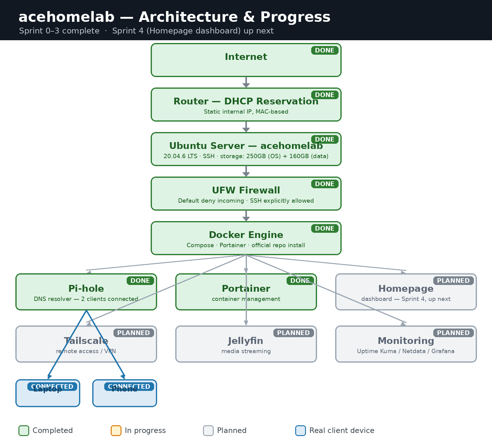

# HomeLab: `acehomelab`

A from-scratch home server build on repurposed hardware, documented as a real infrastructure project rather than a pile of notes. The goal isn't to run services — it's to understand *why* each piece of infrastructure exists, *how* it works internally, and *how* the pieces fit together, one verified step at a time.

**Owner:** Ace-095
**Hostname:** `acehomelab`
**OS:** Ubuntu Server 20.04.6 LTS
**Status:** Sprint 0 through 3.5 complete ✅ — Sprint 4 (Homepage dashboard + Docker/UFW filtering) up next

---

## Philosophy

Every change in this project follows the same rules:

1. **Observe before changing.** Understand current state before touching anything.
2. **One change, one verification.** No stacking untested changes.
3. **Reboot-proof by default.** If it doesn't survive a reboot, it isn't done.
4. **No unnecessary software.** Every installed package earns its place.
5. **Infrastructure before applications.** The foundation gets built before anything runs on top of it.
6. **Understand before automating.**
7. **Every sprint gets documented.** Decisions, reasoning, and verification steps — not just commands.

---

## Hardware

| Component   | Spec                                      |
|-------------|--------------------------------------------|
| CPU         | Intel Core2 Duo E8400 @ 3.0GHz             |
| RAM         | 3 GB usable                                |
| Disk 1      | 250 GB HDD — OS, Docker, configs           |
| Disk 2      | 160 GB HDD — bulk/media storage (~9 yrs power-on time, treated as unreliable — see [Sprint 1](docs/01-storage-and-hardening.md#disk-health)) |
| Network     | Realtek RTL810xE, 100 Mbps                 |

This is old, low-spec hardware on purpose — the constraints force a real understanding of what each service actually costs in RAM/CPU/disk, rather than throwing hardware at problems.

---

## Architecture



Docker Engine, Portainer, and Pi-hole are live — Pi-hole is now the DNS resolver for two real client devices (laptop + phone), with the router-wide switch still pending. Homepage is up next; Tailscale, Jellyfin, and monitoring are still ahead.

---

## Progress

| Sprint | Topic                          | Status         |
|--------|--------------------------------|----------------|
| 0      | OS install, SSH, networking, boot verification | ✅ Complete |
| 1      | Hardening, storage, persistent mounts | ✅ Complete |
| 2      | Docker Engine, Compose, networking, volumes, Portainer | ✅ Complete |
| 3      | Pi-hole, local DNS, ad-blocking | ✅ Complete |
| 4      | Homepage — unified dashboard for all services | 🔄 Up next |
| 5      | Tailscale, SSH key-only auth | ⏳ Planned |
| 6      | Jellyfin, SMB, media organization | ⏳ Planned |
| 7      | Monitoring (Uptime Kuma, Netdata, Prometheus, Grafana) | ⏳ Planned |
| 8      | Backups, cron automation, health checks | ⏳ Planned |
| 9      | Reverse proxy, HTTPS, internal DNS, dedicated IPv6 sprint | ⏳ Planned |

Detailed writeups for completed sprints live in [`docs/`](docs/):

- **[Sprint 0 — Foundation](docs/00-foundation.md)** — OS install decisions, boot fix, networking, SSH
- **[Sprint 1 — Storage & Hardening](docs/01-storage-and-hardening.md)** — firewall, disk health analysis, storage architecture, user strategy
- **[Sprint 2 — Docker Platform](docs/02-docker-platform.md)** — storage finalized, group permissions + SGID, Ubuntu Pro, Docker, Compose, Portainer
- **[Sprint 3 — DNS Infrastructure (Pi-hole)](docs/03-dns-pihole.md)** — DNS fundamentals, staged rollout, port 53 conflict, first real client devices
- **[Sprint 3.5 — Security Hardening](docs/03b-security-hardening.md)** — Docker/UFW investigated, SSH key-only auth, automatic updates, full reboot validation
- **[Roadmap](docs/roadmap.md)** — Sprint 4–9 plan and success criteria

---

## Key engineering decisions at a glance

| Decision | Choice | Why (short version) |
|---|---|---|
| OS | Ubuntu Server 20.04.6 LTS | Stability and documentation depth over bleeding-edge features on old hardware |
| Disk encryption | Disabled (no LUKS) | Server must auto-recover after power loss without a manual passphrase at boot |
| IP addressing | DHCP reservation, not static | Router is the single source of truth; survives OS reinstalls |
| Firewall | UFW, default deny incoming | Every service must explicitly earn a rule — nothing open by default |
| Storage | UUID-based fstab mounts | Device names (`/dev/sdX`) can shift on reboot; UUIDs don't |
| Docker data | Lives on Disk 1 (the reliable disk), not Disk 2 | Disk 2 has real wear (see below) — losing container configs/databases is worse than losing media |
| Users | One admin (`ace`) + role users (`media`, `backup`), apps run in containers | Avoids one-Linux-user-per-app sprawl |
| Shared directory permissions | Group ownership + SGID (`chmod 2775`) | New files auto-inherit the directory's group — no manual `chgrp` after every write |
| Docker installation | Docker's official repo, not `apt install docker.io` or Snap | Current version, no Snap sandboxing quirks when doing networking work later |
| DNS rollout | Pi-hole proven via direct queries first, then one client at a time (laptop → phone → router, last) | DNS has network-wide blast radius; router-wide change saved for last, after it's proven stable |
| SSH authentication | Ed25519 keys only, passwords and root login disabled | Removes the most common remote attack vector; verified with effective-config checks, not just the edited file |
| Security updates | `unattended-upgrades` confirmed active, not just installed | Installing a package isn't the same as confirming the service is running |

---

## Known gaps / next actions

Documenting this honestly is part of the point:

- **Docker/UFW filtering is understood but not yet implemented.** Sprint 3.5 confirmed exactly why Docker bypasses UFW (its rules sit in chains evaluated before UFW's `INPUT` chain) and identified `DOCKER-USER` as the correct fix point — but the actual filtering rules are Sprint 4 work. Until then, Pi-hole's and Portainer's published ports are reachable from anywhere on the LAN, not just the intended clients.
- **No fallback DNS resolver on clients.** If the server goes down, the laptop and phone currently lose DNS entirely — no secondary resolver is configured.
- **Portainer's admin password** — worth confirming it's strong and unique now that HTTPS access is in place.
- **`docker` group membership is root-equivalent** — anyone in it effectively controls the host. Documented, not yet restricted beyond the single admin account.

✅ *Resolved:* Ubuntu 20.04's standard support gap (Ubuntu Pro/ESM, Sprint 2) · `unattended-upgrades` confirmed active (Sprint 3.5) · SSH password authentication disabled in favor of Ed25519 keys, root login disabled (Sprint 3.5) · full reboot persistence validated across Docker, SSH, firewall, updates, and DNS (Sprint 3.5).

---

## Repository structure

```
homelab-networking/
├── README.md
└── docs/
    ├── 00-foundation.md
    ├── 01-storage-and-hardening.md
    ├── 02-docker-platform.md
    ├── 03-dns-pihole.md
    ├── 03b-security-hardening.md
    ├── architecture.png
    └── roadmap.md
```
